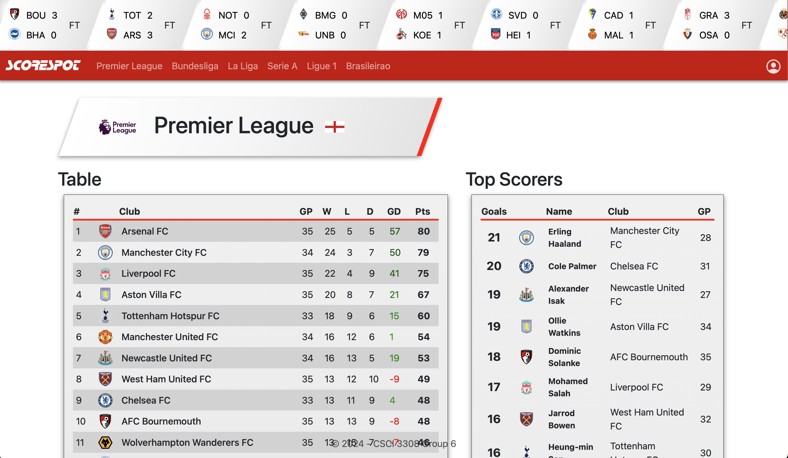
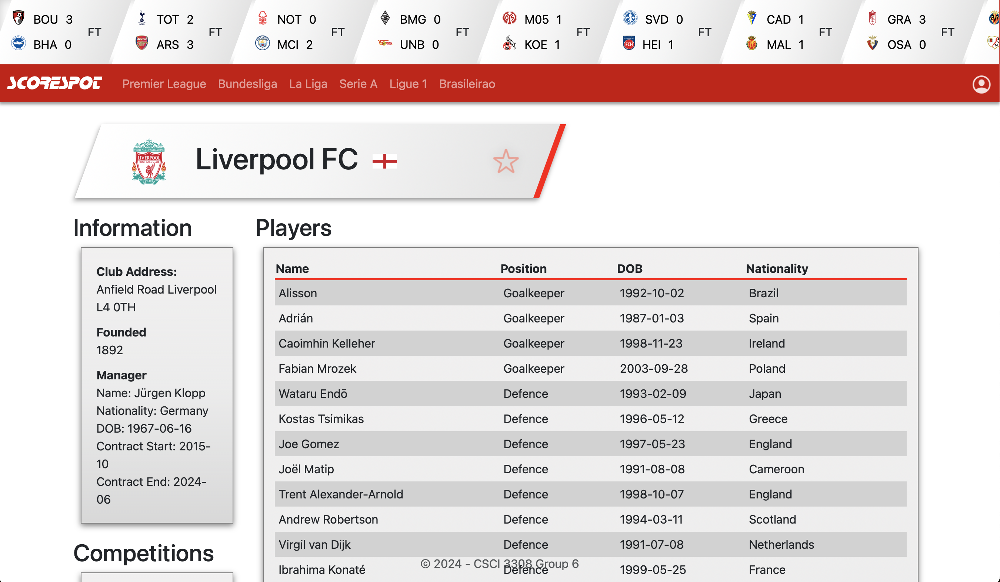
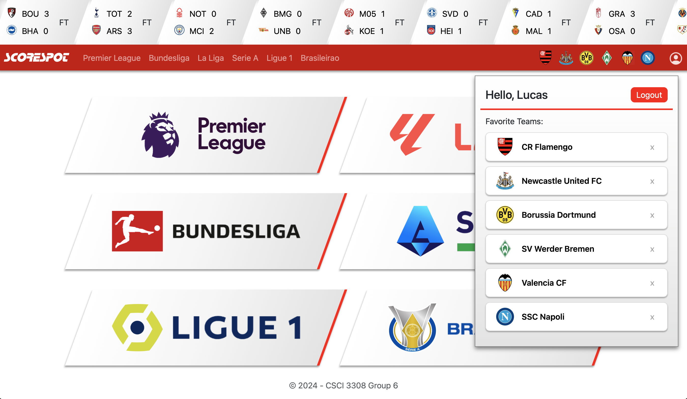

<div style="text-align:center;">
    
</div>

# Welcome to ScoreSpot

ScoreSpot is your go-to destination for all things soccer. Whether you're a die-hard fan or just getting into the game, ScoreSpot has you covered. Dive into the world of soccer with ease as you explore league standings, top scorers, and more.

Our comprehensive platform offers detailed league information, including standings and top scorers, allowing you to stay up-to-date with the latest developments in your favorite leagues. From the English Premier League to La Liga, Serie A, Bundesliga, and beyond, ScoreSpot provides a complete overview of the global soccer landscape.

But that's not all. ScoreSpot goes beyond just league statistics. With dedicated club pages, you can delve into the heart of your favorite teams. Explore detailed club information, including manager information and squad rosters. Get to know the players who grace the field and the managers who lead them to victory.

Whether you're looking to keep track of your favorite team's performance or simply stay informed about the latest soccer news and stats, ScoreSpot is the ultimate companion for every soccer enthusiast. Join us today and elevate your soccer experience to new heights.

## ScoreSpot Screenshots

### Homepage


### Leagues Page



### Individual Club Page



### Account Management



# Who Developed ScoreSpot?

ScoreSpot was developed by University of Colorado students: Lucas Patenaude, Vishal Vunnam, Dominykas Jakubauskas, Dip Thapa, and Aviral Mittal

# Technology Stack

ScoreSpot harnesses cutting-edge technology to deliver a seamless and immersive soccer experience to fans worldwide. At the core of ScoreSpot's architecture lies Docker, empowering our platform with scalability, flexibility, and efficiency. Leveraging Docker containers, we orchestrate a robust environment comprising Node.js and PostgreSQL images.

On the frontend, Node.js takes center stage, driving the interactive and dynamic elements of ScoreSpot's user interface. With its asynchronous, event-driven architecture, Node.js ensures lightning-fast responsiveness, allowing users to navigate through league standings, player profiles, and match statistics with ease.

Backing our frontend prowess is PostgreSQL. PostgreSQL serves as the backbone of ScoreSpot's backend, storing essential account information like usernames and securely encrypted passwords. Additionally, it manages the association between users and their favorite clubs, facilitating personalized experiences for users while ensuring data integrity and security.

To fuel ScoreSpot with real-time soccer statistics, we integrate seamlessly with the [football-data.org API](https://www.football-data.org). By tapping into this comprehensive data source, ScoreSpot delivers up-to-the-minute updates on league standings, top scorers, and match details, keeping fans informed and engaged throughout the season.

ScoreSpot's architecture is further fortified by Handlebars templating and Express.js, which serve as the backbone of our dynamic content generation and routing system. Handlebars empowers us to create reusable HTML templates, streamlining the development process and ensuring consistency across the platform. Meanwhile, Express.js facilitates smooth navigation through ScoreSpot's various sections, dynamically generating URL routes based on league and club IDs retrieved from the football-data.org API.

With its sophisticated tech setup, ScoreSpot brings innovation to soccer stat tracking, providing fans with an exceptional experience that blends state-of-the-art technology with a love for the game.

# How to Deploy ScoreSpot

> [!WARNING]
> In order to deploy ScoreSpot you must have the following installed to your operating sytem:
>
> 1. [Docker](https://docs.docker.com/get-docker/)
> 2. [Docker-Compose](https://docs.docker.com/compose/install/)
> 3. [Node.js](https://nodejs.org/en/download)

## 1. Clone the Repository to Your System

**Once the following dependencies above are installed navigate to the top of the repsoitory and copy the following link:**

> https://github.com/LucasPatenaude/ScoreSpot.git


**Using a Git GUI or the terminal select a location to store the repository. In this example, I'll store it in a folder called `programming` in the home directory**

1. First navigate to the home directory:

    > On Mac and Linux

    `cd ~`

    > On Windows

    `cd /c/Users/<YourUsername>` <--- Replace with your windows user name


2. In the home directory create a folder called `programming`

    > On All Systems

    `mkdir programming`


3. Now that `programming` is created navigate to it

    > On All Systems

    `cd programming`


4. **Now that you're in the `~/programming` directory it's time to clone the repository**

    > On All Systems

    `git clone https://github.com/LucasPatenaude/ScoreSpot.git`

> [!TIP]
> Congrats! ScoreSpot should now be cloned into `~/programming`

---

## 2. Deploying the ScoreSpot Container/Application

**Now that ScoreSpot's files are on your system it's time to deploy the application**

1. Inside of the `~/programming` folder you should now see a folder called `ScoreSpot`, navigate to it:

    > On All Systems

    `cd ScoreSpot`

2. Once inside of `~/programming/ScoreSpot` you should see see a folder called `ProjectSourceCode`, navigate to it:

    > On All Systems

    `cd ProjectSourceCode`

3. Run the Docker Compose file inside `~/programming/ScoreSpot/ProjectSourceCode`:

    > On All Systems

    `docker-compose up -d`

> [!TIP]
> Congragulations! ScoreSpot should now be deployed on your server at port 3000
> 
> To enter your ScoreSpot deployment enter `localhost:3000/` into your browser's addess bar

---

# Modifying the Application to Run Tests

**In order to run ScoreSpots built in tests a modification to `package.json` inside of `~/programming/ScoreSpot/ProjectSourceCode/` is required**

1. Navigate to `/ProjectSourceCode` directory:

    > On Mac and Linux

    `cd ~/programming/ScoreSpot/ProjectSourceCode/`

    > On Windows

    `cd /c/Users/<YourUsername>/programming/ScoreSpot/ProjectSourceCode/

2. Edit the `package.json` file inside `cd ~/programming/ScoreSpot/ProjectSourceCode/`

    > On All Systems

    `nano package.json`

3. Find the following lines inside the `package.json` file:

    ```
    "scripts": {
        "prestart": "npm install",
        "start": "nodemon index.js",
        "test": "mocha",
        "testandrun": "npm run && npm start"
    }
    ```

4. Modify the line `"testandrun": "npm run && npm start"` to `"npm run prestart && npm run test && npm start"`. The previous block should now look as follows:

    ```
    "scripts": {
            "prestart": "npm install",
            "start": "nodemon index.js",
            "test": "mocha",
            "testandrun": "npm run prestart && npm run test && npm start"
        }
    ```
> [!TIP]
> Congragulations! ScoreSpot should now show it's test results on bootup
> 
> To view the test results navigate to Docker and open the container's logs

# View ScoreSpot Azure Deployment

If you'd like to view an instance of ScoreSpot that's already deployed to the web it can be found at:

http://recitation-13-team-06.eastus.cloudapp.azure.com:3000/home
